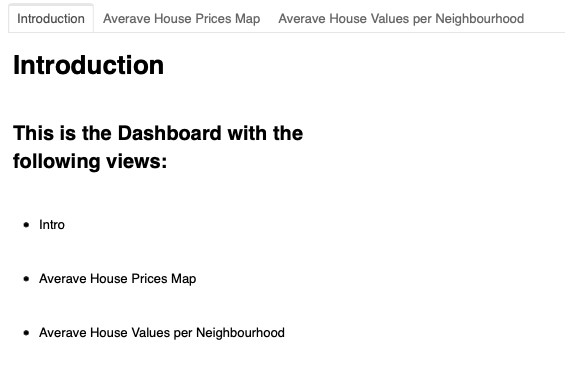
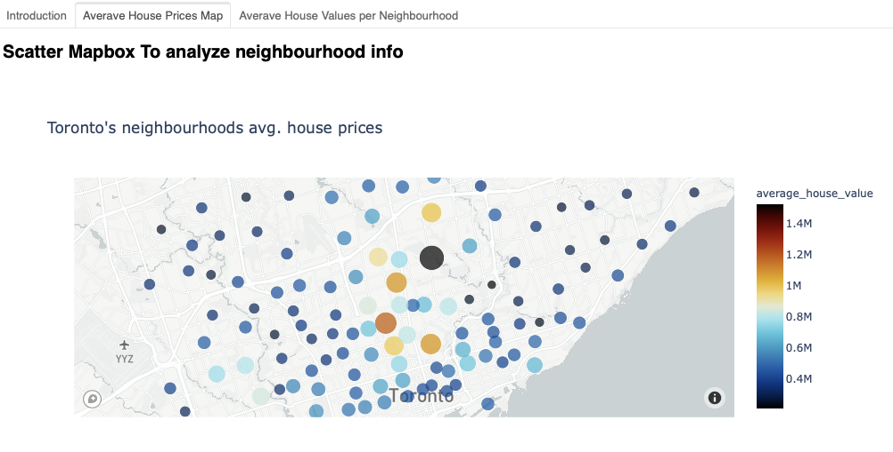

# Toronto Dwellings Analysis Dashboard

In this notebook, you will compile the visualizations from the previous analysis into functions to create a Panel dashboard.


```python
# imports
#import panel as pn
#pn.extension('plotly')
#import plotly.express as px
#import pandas as pd
#import matplotlib.pyplot as plt
#import os
#from pathlib import Path
#from dotenv import load_dotenv

# imports
import panel as pn
import plotly.express as px
import pandas as pd
import matplotlib.pyplot as plt
import os
from pathlib import Path
from dotenv import load_dotenv
from panel.interact import interact
from panel import widgets
```


```python
# Initialize the Panel Extensions (for Plotly)
import panel as pn
pn.extension("plotly")
```


```python
# Import hvplot.pandas after pn.extension
# This avoids plotly initialization failure
import hvplot.pandas
```


```python
# Read the Mapbox API key
load_dotenv()
map_box_api = os.getenv("mapbox")
px.set_mapbox_access_token(map_box_api)
```

# Import Data


```python
# Import the CSVs to Pandas DataFrames
file_path1 = Path("Data/toronto_neighbourhoods_census_data.csv")
to_data = pd.read_csv(file_path1, index_col="year")

file_path2 = Path("Data/toronto_neighbourhoods_coordinates.csv")
df_neighbourhood_locations = pd.read_csv(file_path2)
```

- - -

## Panel Visualizations

In this section, you will copy the code for each plot type from your analysis notebook and place it into separate functions that Panel can use to create panes for the dashboard. 

These functions will convert the plot object to a Panel pane.

Be sure to include any DataFrame transformation/manipulation code required along with the plotting code.

Return a Panel pane object from each function that can be used to build the dashboard.

Note: Remove any `.show()` lines from the code. We want to return the plots instead of showing them. The Panel dashboard will then display the plots.

### Global available data


```python
# Getting the data from the top 10 expensive neighbourhoods
to_top_10neighbourhoods=to_data.groupby(by=["neighbourhood"]).mean().nlargest(10,"average_house_value")

# Calculate the mean number of dwelling types units per year
df_avg_dwelling_types = to_data.drop(columns=["average_house_value"]).groupby(by="year").mean()


# Calculate the average monthly shelter costs for owned and rented dwellings
df_monthly_shelter_costs=pd.DataFrame(round(to_data[["shelter_costs_owned","shelter_costs_rented"]].groupby("year").mean(),2))

```

### Panel Visualization Functions


```python
# Define Panel visualization functions
def neighbourhood_map():
    """Neighbourhood Map"""
    # Join the average values with the neighbourhood locations
    df_to_avg_house_prices= to_data.groupby(by=["neighbourhood"]).mean()
    df_to_avg_house_prices_with_location = pd.merge(df_neighbourhood_locations,df_to_avg_house_prices,on="neighbourhood",how="inner")
    plot_to_neighbourhoods = px.scatter_mapbox(
    df_to_avg_house_prices_with_location,
    lat="lat",
    lon="lon",
    size="average_house_value",
    color="average_house_value",
    color_continuous_scale=px.colors.cyclical.IceFire,
    zoom=10, 
    title="Toronto's neighbourhoods avg. house prices", 
    width=1000,
    )
    return plot_to_neighbourhoods

def create_bar_chart(data, title, xlabel, ylabel, color):
    """
    Create a barplot based in the data argument.
    """
    plot = data.hvplot(kind="bar", rot=90,yformatter='%f')
    plot.opts(title=title)
    plot.opts(xlabel=xlabel)
    plot.opts(ylabel=ylabel)
    plot.opts(color=color)
    return plot

def create_line_chart(data, title, xlabel, ylabel, color):
    """
    Create a line chart based in the data argument.
    """
    return data.plot(title=title, ylabel=ylabel,xlabel=xlabel,color=color)
    
    # YOUR CODE HERE!

def average_house_value():
    """Average house values per year."""
    to_data = pd.read_csv(file_path1, index_col=["year","neighbourhood"])
    avg_home_value_per_neighbourhood = to_data["average_house_value"].groupby(by=["year","neighbourhood"]).mean()
    return avg_home_value_per_neighbourhood

def average_value_by_neighbourhood():
    """Average house values by neighbourhood."""
    return average_house_value().hvplot(kind="line", x="year", y="average_house_value", width=600, groupby="neighbourhood",widget_location="top_left")


def number_dwelling_types():
    """Number of dwelling types per year"""
    return  df_avg_dwelling_types.hvplot(kind="bar", x='year', rot=90 , xlabel="year",ylabel="dwelling type units",groupby="neighbourhood",width=600)   


def average_house_value_snapshot():
    """Average house value for all Toronto's neighbourhoods per year."""
    avg_home_value_per_year = to_data["average_house_value"].groupby(by="year").mean()
    return avg_home_value_per_year.hvplot(kind="line", x="year", y="average_house_value", width=600)

def top_most_expensive_neighbourhoods():
    """Top 10 most expensive neighbourhoods."""
    return to_top_10neighbourhoods.hvplot(kind="bar",x="neighbourhood", y="average_house_value", xlabel="Neighbourhood",ylabel="Average House Value", rot=90 ,width=1000,height=600)

def sunburts_cost_analysis():
    """Sunburst chart to conduct a costs analysis of most expensive neighbourhoods in Toronto per year."""
    
    # YOUR CODE HERE!
```

## Panel Dashboard

In this section, you will combine all of the plots into a single dashboard view using Panel. Be creative with your dashboard design!


```python
# Create a Title for the Dashboard
dash_title = "# Introduction"

# Define a welcome text
dash_welcome_txt = "## This is the Dashboard with the following views:"

# Create a tab layout for the dashboard
intro_column = pn.Column(dash_title, dash_welcome_txt, "* Intro", "* Averave House Prices Map","* Averave House Values per Neighbourhood")
map_column = pn.Column("## Scatter Mapbox To analyze neighbourhood info", neighbourhood_map())
avg_house_column = pn.Column("## Average house values by neighbourhood", average_value_by_neighbourhood())

# Create the main dashboard
dashboard = pn.Tabs(
    ("Introduction",intro_column),
    ("Averave House Prices Map",map_column),
    ("Averave House Values per Neighbourhood",avg_house_column)    
)

```

## Serve the Panel Dashboard


```python
dashboard.servable()
```







# Debugging

Note: Some of the Plotly express plots may not render in the notebook through the panel functions.

However, you can test each plot by uncommenting the following code


```python
# neighbourhood_map().show()
```


```python
# create_bar_chart(data, title, xlabel, ylabel, color)

# # Bar chart for 2001
# create_bar_chart(df_dwelling_units.loc[2001], "Dwelling Types in Toronto in 2001", "2001", "Dwelling Type Units", "red")

# # Bar chart for 2006
# create_bar_chart(df_dwelling_units.loc[2006], "Dwelling Types in Toronto in 2006", "2006", "Dwelling Type Units", "blue")

# # Bar chart for 2011
# create_bar_chart(df_dwelling_units.loc[2011], "Dwelling Types in Toronto in 2011", "2011", "Dwelling Type Units", "orange")

# # Bar chart for 2016
# create_bar_chart(df_dwelling_units.loc[2016], "Dwelling Types in Toronto in 2016", "2016", "Dwelling Type Units", "magenta")
```


```python
# create_line_chart(data, title, xlabel, ylabel, color)

# # Line chart for owned dwellings
# create_line_chart(df_avg_costs["shelter_costs_owned"], "Average Monthly Shelter Cost for Owned Dwellings in Toronto", "Year", "Avg Monthly Shelter Costs", "blue")

# # Line chart for rented dwellings
# create_line_chart(df_avg_costs["shelter_costs_rented"], "Average Monthly Shelter Cost for Rented Dwellings in Toronto", "Year", "Avg Monthly Shelter Costs", "orange")
```


```python
# average_house_value()
```


```python
# average_value_by_neighbourhood()
```


```python
# number_dwelling_types()
```


```python
# average_house_value_snapshot()
```


```python
# top_most_expensive_neighbourhoods()
```


```python
# sunburts_cost_analysis()
```
